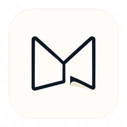
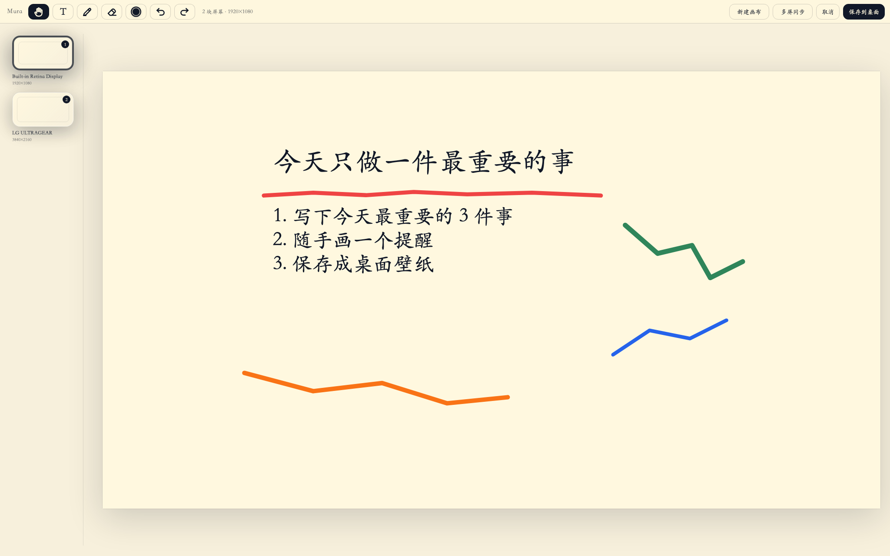
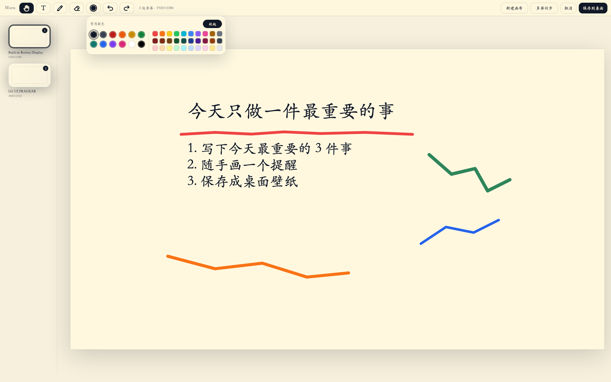

<p align="center">
  
</p>

<h1 align="center">Mura</h1>

<p align="center">
  把一块有限画布，变成你的桌面壁纸。
</p>

<p align="center">
  <a href="https://github.com/JNHFlow21/Mura/releases/latest"><strong>下载最新版</strong></a>
</p>

<p align="center">
  <a href="LICENSE"></a>
</p>



## Mura 是什么？

Mura 是一个很简单的 macOS 小工具：

> 你打开一块有限画布，在上面写字、涂鸦，然后把它保存成桌面壁纸。

它适合放那些你每天打开电脑就应该看见的东西：

- 今天最重要的几件事
- 一句提醒自己的话
- 一个随手画下来的箭头、圈、线条
- 不同屏幕上的不同提示

Mura 不想做复杂的任务管理软件。它只做一件事：**让你的桌面本身变成一块提醒画布。**

## 你可以做什么？

### 写下今天最重要的事情

用文字工具直接在画布上输入，保存后就是你的桌面壁纸。

### 随手涂鸦

用画笔画线、圈重点、加箭头，也可以用颜色区分不同提醒。



### 保存到桌面

点击「保存到桌面」后，Mura 会把当前画布渲染成一张静态壁纸。保存完不需要一直占用一个编辑器窗口。

## 安装

🚀一键安装使用：打开「终端」，复制下面这一行命令回车即可。它会自动下载 Release 版本、安装到 `/Applications`、清除未签名版本的 quarantine 标记，并打开 Mura。

```bash
curl -fsSL https://raw.githubusercontent.com/JNHFlow21/Mura/main/script/install_release.sh | bash
```

如果你的 Mac 要求权限，终端会提示你输入登录密码。

也可以手动安装：

1. 打开 [Releases](https://github.com/JNHFlow21/Mura/releases/latest)。
2. 下载 `Mura-v1.dmg`。
3. 打开 DMG，把 `Mura.app` 拖进 `/Applications`。
4. 启动 Mura。

## 如果 macOS 提示无法打开

当前 v1 是未上架 App Store、未 Apple notarize 的版本，所以 macOS 可能会提示：

- “无法打开，因为无法验证开发者”
- “Apple 无法检查其是否包含恶意软件”
- “App 已损坏，无法打开”
- “Mura-v1.dmg is damaged and can’t be opened”

如果 **DMG 文件本身打不开**，先对下载的 DMG 执行：

```bash
sudo xattr -rd com.apple.quarantine ~/Downloads/Mura-v1.dmg
open ~/Downloads/Mura-v1.dmg
```

然后把 `Mura.app` 拖进 `/Applications`。如果拖进去之后 **Mura.app 仍然打不开**，再执行：

```bash
sudo xattr -rd com.apple.quarantine /Applications/Mura.app
open /Applications/Mura.app
```

注意：如果你还没有把 `Mura.app` 拖进 `/Applications`，`/Applications/Mura.app` 不存在，运行第二段命令就会出现 `No such file`。

只建议对从官方 Release 下载的 `Mura-v1.dmg` / `Mura.app` 执行这些命令。

## 隐私

Mura 是本地优先的桌面工具。画布内容保存在你的 Mac 本地，不需要账号，也不会上传你的提醒内容。

## 下载

- [下载 Mura-v1.dmg](https://github.com/JNHFlow21/Mura/releases/latest/download/Mura-v1.dmg)
- [查看所有 Release](https://github.com/JNHFlow21/Mura/releases)

## Star History

<a href="https://www.star-history.com/#JNHFlow21/Mura&Date">
  <picture>
    <source media="(prefers-color-scheme: dark)" srcset="https://api.star-history.com/svg?repos=JNHFlow21/Mura&type=Date&theme=dark" />
    <source media="(prefers-color-scheme: light)" srcset="https://api.star-history.com/svg?repos=JNHFlow21/Mura&type=Date" />
    
  </picture>
</a>

## License

Mura is open source under the [MIT License](LICENSE).
