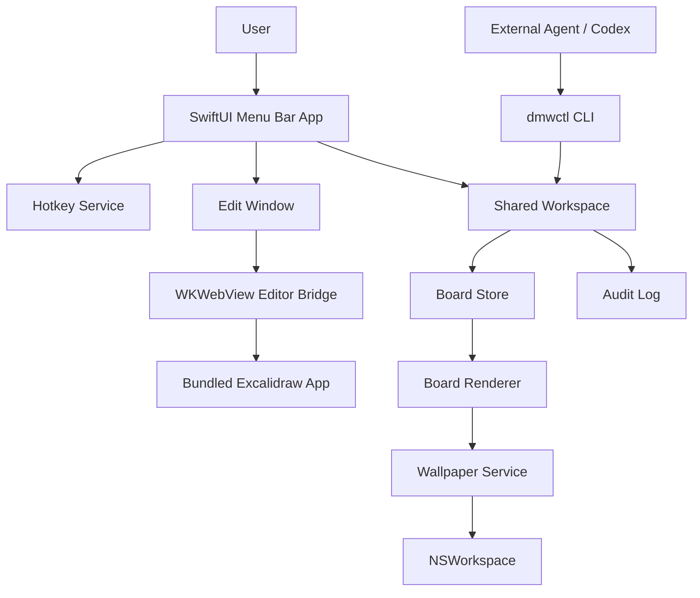
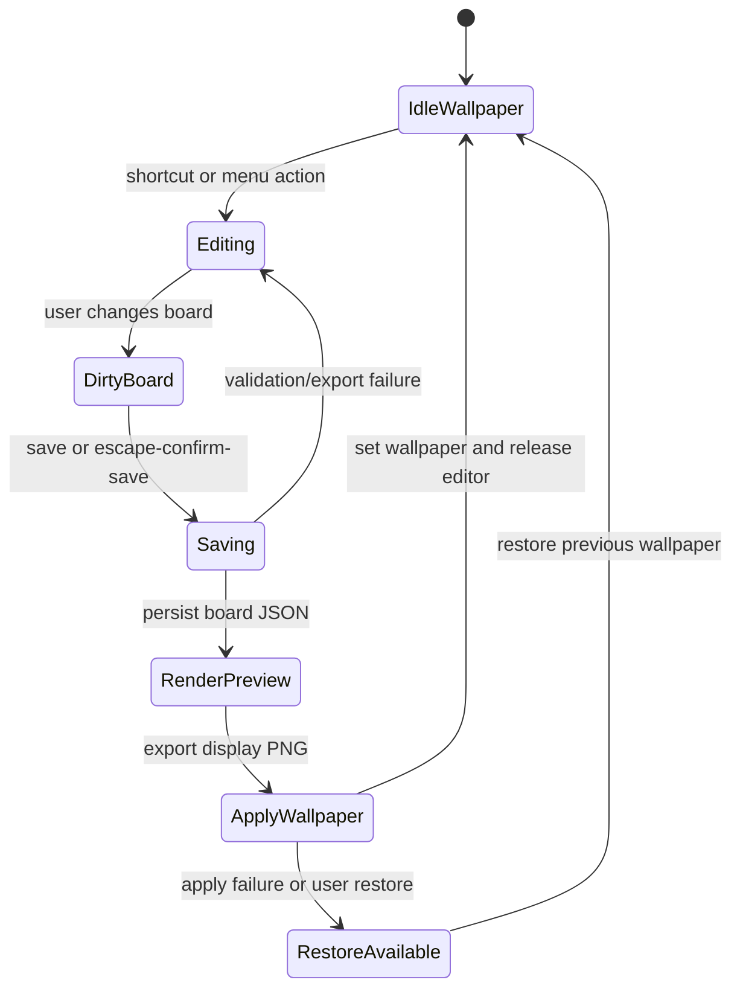
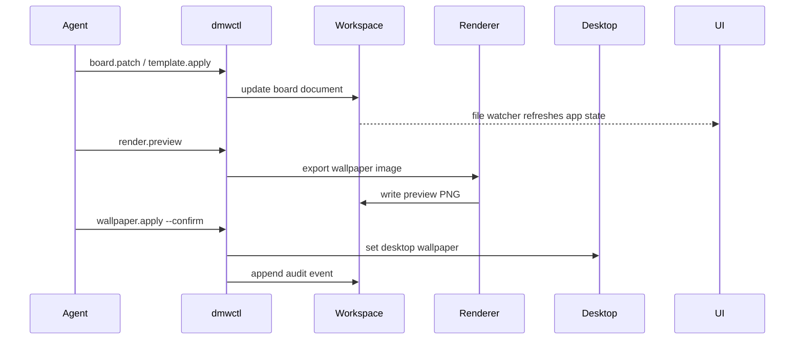

# feat: Build Desktop Memory Wall

## Summary

Build a lightweight macOS “Desktop Memory Wall” that lets the user enter an Excalidraw-like edit mode, write large hand-drawn reminders, save, and then replace the desktop wallpaper with a static rendered image so the app returns to near-idle resource use.

The architecture is Agent First: UI actions, CLI actions, and future agent actions operate on the same file workspace through small primitive tools, with full parity between user and agent capabilities.

---

## Problem Frame

The user wants a persistent external memory surface because ordinary reminder apps disappear behind windows and existing wallpaper or sticky-note tools do not match the desired workflow. The closest mental model is “Excalidraw directly on my desktop”: enter edit mode, freely write or draw, exit edit mode, and leave the result quietly visible as the wallpaper.

Earlier product research ruled out the available off-the-shelf options for this use case: sticky-note apps are not a true whiteboard, live-web wallpaper tools such as Plash can fail to install or introduce runtime coupling, and Wallpaper Engine’s EZ Notes prior-art item is not a stable Mac-native path. The plan therefore builds the smallest native system that preserves the Excalidraw editing experience while avoiding a permanently running web wallpaper.

---

## Research Synthesis

- Apple’s `NSWorkspace.setDesktopImageURL(_:for:options:)` is the native wallpaper boundary for setting an image on a given `NSScreen`; `desktopImageURL(for:)` allows reading the previous image for restore/backup behavior.
- Apple’s desktop image option keys include scaling, clipping, and fill-color controls, which are required to avoid unexpected wallpaper layout changes.
- `WKWebView.evaluateJavaScript` gives the native shell a supported bridge to call local Excalidraw export logic and receive success or failure on the main thread callback path.
- Excalidraw’s developer docs support embedding `@excalidraw/excalidraw` as a React component and exporting diagrams with utilities such as `exportToBlob` / `exportToSvg`; the docs also call out self-hosted fonts via `EXCALIDRAW_ASSET_PATH`, which matters for offline, low-surprise wallpaper rendering.
- `KeyboardShortcuts` by Sindre Sorhus is a small macOS Swift package for user-customizable global shortcuts and is sandbox / Mac App Store compatible; it is a better v1 dependency than custom Carbon hotkey code unless implementation proves otherwise.

---

## Requirements

### Product Experience

- R1. The app must provide a one-action edit entry point from the menu bar and a configurable global shortcut.
- R2. Edit mode must feel like a large Excalidraw-style whiteboard, with default text sizes large enough to be readable from normal desktop distance.
- R3. Saving edit mode must persist the editable board document and render a static wallpaper image for the active display.
- R4. After save, the editor must close or fully release the web editing surface so the idle app does not retain a background WebView.
- R5. The user must be able to restore the previous wallpaper from a local backup if the rendered wallpaper is wrong.

### Architecture and Performance

- R6. The app must avoid Electron, always-on web wallpaper, or a constantly composited overlay.
- R7. The codebase must keep high cohesion and low coupling by isolating domain models, storage, rendering, wallpaper application, editor bridge, hotkeys, and agent tools behind protocols.
- R8. The rendering pipeline must support at least the current main display in v1 and preserve a path to per-display rendering.
- R9. The app must keep all user data local by default, with human-readable files for board data, preferences, templates, context, snapshots, and audit logs.

### Agent First

- R10. Every user-visible UI action must have an equivalent CLI or file/tool primitive so an external agent can perform the same outcome.
- R11. Tools must be primitive CRUD-style operations rather than workflow-shaped commands that hide judgment in code.
- R12. Agent and UI must operate on the same workspace so agent changes appear in the app without a separate import/export step.
- R13. Destructive or hard-to-undo actions must require a backup, confirmation flag, or preview before apply.
- R14. User preferences and accumulated guidance must live in `docs/agent/context.md` or runtime `context.md` so behavior can improve through prompt/context edits instead of app code changes.

### Development Quality

- R15. The first implementation must include automated tests for domain, storage, rendering decisions, wallpaper service boundaries, and agent parity.
- R16. The app must include a repeatable local build/run path for Codex and a lightweight diagnostics surface for performance and wallpaper failures.

---

## Key Technical Decisions

- KTD1. Static wallpaper after edit: render the board to PNG and set it as wallpaper instead of keeping a live desktop overlay. This is the only design that satisfies low CPU, low memory, and non-interference with Finder / Spaces.
- KTD2. Native shell with local Excalidraw editor: use a SwiftUI/AppKit macOS shell and load a bundled local Excalidraw editor only during edit mode. This reuses Excalidraw’s proven drawing UX without adopting Electron.
- KTD3. File workspace as the source of truth: store board JSON, rendered PNGs, settings, templates, snapshots, context, and audit logs in a shared local workspace. This gives the UI and agents the same operating surface.
- KTD4. Protocol-first service boundaries: define `BoardStore`, `EditorBridge`, `BoardRenderer`, `WallpaperService`, `DisplayService`, `HotkeyService`, and `AgentToolRegistry` interfaces before implementation. This keeps modules cohesive and testable.
- KTD5. Agent-ready, not model-embedded in v1: ship a local CLI and context files rather than embedding an LLM loop in the menu bar app. External agents can operate through primitives immediately, and embedded agents can be added later without changing the workspace contract.
- KTD6. Local assets and fonts: self-host Excalidraw assets and fonts in the app bundle so editing and rendering work offline and avoid CDN variance in exported wallpapers.
- KTD7. Wallpaper operations are reversible: before applying a new wallpaper, read and store the previous desktop image URL and options when available. Restore is a first-class action, not a debugging escape hatch.
- KTD8. One foreground editor window at a time: v1 uses a focused edit window rather than multiple live canvases. Multi-display rendering can exist, but concurrent editors are deferred to avoid lifecycle and state conflicts.
- KTD9. Reuse small dependencies only when they reduce platform risk: `KeyboardShortcuts` is allowed for user-configurable global hotkeys; avoid broader UI or persistence frameworks until a local need proves they are worthwhile.

---

## Agent First Compliance

| Principle | Plan commitment |
|---|---|
| Parity | Menu actions map to `dmwctl` commands and workspace file operations. |
| Granularity | CLI primitives read, write, patch, render, apply, restore, list displays, and inspect status; they do not decide what the user should remember. |
| Composability | Future behaviors such as “summarize my day onto the wall” become prompts operating on the same primitives. |
| Emergent capability | Agents can create templates, reorganize board elements, render previews, and apply wallpapers without new product features. |
| Improvement over time | `context.md`, templates, and audit logs let the system learn preferred wording, font scale, and reminder style without code changes. |

---

## High-Level Technical Design

### Component Topology



### Edit-Save-Idle Lifecycle



### Agent Parity Flow



---

## Output Structure

```text
Package.swift
DesktopMemoryWall.xcodeproj
App/DesktopMemoryWallApp/DesktopMemoryWallApp.swift
App/DesktopMemoryWallApp/AppDelegate.swift
App/DesktopMemoryWallApp/Resources/Editor/
EditorWeb/package.json
EditorWeb/src/
Sources/MemoryWallCore/
Sources/MemoryWallWorkspace/
Sources/MemoryWallEditorBridge/
Sources/MemoryWallRenderer/
Sources/MemoryWallWallpaper/
Sources/MemoryWallAgentTools/
Sources/dmwctl/
Tests/MemoryWallCoreTests/
Tests/MemoryWallWorkspaceTests/
Tests/MemoryWallEditorBridgeTests/
Tests/MemoryWallRendererTests/
Tests/MemoryWallWallpaperTests/
Tests/MemoryWallAgentToolsTests/
Tests/dmwctlTests/
docs/agent/context.md
docs/architecture/tool-parity.md
docs/plans/2026-06-19-001-feat-desktop-memory-wall-plan.md
script/build_and_run.sh
script/build_editor_assets.sh
.codex/environments/environment.toml
```

---

## Implementation Units

### U1. Native Project Scaffold and Boundaries

- **Goal:** Create a macOS app scaffold with a thin app target, reusable Swift package modules, a bundled web editor asset target, and a CLI product.
- **Requirements:** R6, R7, R15, R16.
- **Dependencies:** None.
- **Files:** `Package.swift`, `DesktopMemoryWall.xcodeproj`, `App/DesktopMemoryWallApp/DesktopMemoryWallApp.swift`, `App/DesktopMemoryWallApp/AppDelegate.swift`, `script/build_and_run.sh`, `.codex/environments/environment.toml`, `Tests/MemoryWallCoreTests/ModuleBoundaryTests.swift`.
- **Approach:** Keep the app target responsible for lifecycle, menu bar integration, and windows only. Put reusable logic in Swift package modules. Use the Xcode app target for bundle resources and macOS app metadata, but keep core behavior buildable and testable through SwiftPM.
- **Patterns to follow:** SwiftUI app structure uses explicit scenes, small app entry files, and separate `Sources` / `Tests` modules.
- **Test scenarios:**
  - Build graph exposes all planned library and executable products without circular dependencies.
  - Core modules compile without importing app-only lifecycle code.
  - The app target can load packaged resources through a resource lookup abstraction instead of hardcoded paths.
- **Verification:** The project has a repeatable app launch path, a testable package graph, and no monolithic root view or service file.

### U2. Shared Workspace and Board Document Model

- **Goal:** Define the local workspace contract and durable board model that both UI and agents use.
- **Requirements:** R3, R5, R7, R9, R10, R12, R14, R15.
- **Dependencies:** U1.
- **Files:** `Sources/MemoryWallCore/BoardDocument.swift`, `Sources/MemoryWallCore/BoardElement.swift`, `Sources/MemoryWallCore/DisplayProfile.swift`, `Sources/MemoryWallWorkspace/WorkspaceLayout.swift`, `Sources/MemoryWallWorkspace/BoardStore.swift`, `Sources/MemoryWallWorkspace/SnapshotStore.swift`, `Sources/MemoryWallWorkspace/AuditLog.swift`, `docs/agent/context.md`, `Tests/MemoryWallCoreTests/BoardDocumentTests.swift`, `Tests/MemoryWallWorkspaceTests/WorkspaceStoreTests.swift`.
- **Approach:** Preserve Excalidraw JSON as the editable source format and wrap it with app metadata for display profiles, active template, and rendering preferences. Store files under the app support workspace at runtime, but keep test stores path-injectable.
- **Patterns to follow:** Files are the universal interface; CRUD completeness applies to boards, templates, snapshots, and settings.
- **Test scenarios:**
  - First launch with an empty workspace creates default board, context, template, snapshot, and audit-log locations.
  - Loading and saving a board preserves unknown Excalidraw fields rather than normalizing them away.
  - Corrupt board JSON is rejected with a recoverable error and does not overwrite the last valid snapshot.
  - Snapshot creation records the previous wallpaper metadata before a new rendered wallpaper is applied.
  - File watcher or reload hooks surface external changes made by `dmwctl` without requiring app restart.
- **Verification:** A user or agent can inspect the workspace files directly and understand the active board, recent renders, and rollback path.

### U3. Bundled Excalidraw Editor Bridge

- **Goal:** Embed a local Excalidraw editor in edit mode and expose a narrow typed bridge for loading, saving, exporting, and error reporting.
- **Requirements:** R1, R2, R3, R4, R6, R7, R15.
- **Dependencies:** U1, U2.
- **Files:** `EditorWeb/package.json`, `EditorWeb/src/App.tsx`, `EditorWeb/src/nativeBridge.ts`, `EditorWeb/src/exportBoard.ts`, `EditorWeb/src/defaultScene.ts`, `Sources/MemoryWallEditorBridge/EditorBridge.swift`, `Sources/MemoryWallEditorBridge/WebEditorView.swift`, `Sources/MemoryWallEditorBridge/WebEditorCoordinator.swift`, `App/DesktopMemoryWallApp/Resources/Editor/`, `Tests/MemoryWallEditorBridgeTests/EditorBridgeTests.swift`, `EditorWeb/src/__tests__/nativeBridge.test.ts`.
- **Approach:** Treat the web editor as an adapter, not the app core. Swift owns the workspace and lifecycle; the web bridge receives a board payload, emits board changes, and exports PNG/SVG data on request. Self-host all Excalidraw fonts/assets and set the asset path for offline rendering.
- **Patterns to follow:** Use a narrow AppKit/WebKit interop boundary; SwiftUI owns state, while `WKWebView` handles only the editor surface.
- **Test scenarios:**
  - Loading an existing board shows its elements and metadata in the editor surface.
  - Creating a large text element with the default hand-drawn style persists to the board document.
  - Export returns a PNG blob for the target display size and includes the local font styling.
  - Invalid bridge messages are rejected and logged without corrupting board state.
  - Editor close releases the WebView reference and leaves the app in idle mode.
- **Verification:** Edit mode behaves like a focused whiteboard and does not leak editor runtime into the idle state.

### U4. Rendering and Wallpaper Pipeline

- **Goal:** Render saved boards to display-sized images, apply them as wallpaper, and restore previous wallpapers safely.
- **Requirements:** R3, R4, R5, R6, R8, R13, R15.
- **Dependencies:** U2, U3.
- **Files:** `Sources/MemoryWallRenderer/BoardRenderer.swift`, `Sources/MemoryWallRenderer/RenderJob.swift`, `Sources/MemoryWallRenderer/RenderOutput.swift`, `Sources/MemoryWallWallpaper/DisplayService.swift`, `Sources/MemoryWallWallpaper/WallpaperService.swift`, `Sources/MemoryWallWallpaper/WallpaperSnapshot.swift`, `Tests/MemoryWallRendererTests/BoardRendererTests.swift`, `Tests/MemoryWallWallpaperTests/WallpaperServiceTests.swift`.
- **Approach:** Render only on save, preview, or explicit agent request. Apply wallpaper through a protocol-wrapped `NSWorkspace` service on the main thread. Capture previous wallpaper URL/options before replacement and keep a restore command available.
- **Patterns to follow:** Native wallpaper API boundary is isolated so tests can use fakes and implementation can handle macOS quirks without touching editor or storage code.
- **Test scenarios:**
  - Rendering a board for a known display size writes a PNG with exact pixel dimensions for that display.
  - Applying wallpaper records the prior wallpaper URL and options before setting the new image.
  - Restore uses the latest valid snapshot and records an audit event.
  - Wallpaper apply failure leaves the previous snapshot intact and returns an actionable error.
  - Multi-display discovery returns stable display profiles and does not assume a single screen.
- **Verification:** Save-to-wallpaper succeeds for the active display, fails safely, and always leaves a restore path.

### U5. Menu Bar App, Hotkey, Settings, and Editor Lifecycle

- **Goal:** Provide the user-facing macOS shell: menu bar controls, configurable hotkey, edit window, save/cancel behavior, and basic settings.
- **Requirements:** R1, R2, R4, R5, R6, R7, R16.
- **Dependencies:** U2, U3, U4.
- **Files:** `App/DesktopMemoryWallApp/DesktopMemoryWallApp.swift`, `App/DesktopMemoryWallApp/AppDelegate.swift`, `App/DesktopMemoryWallApp/Scenes/MenuBarScene.swift`, `App/DesktopMemoryWallApp/Scenes/EditWindowScene.swift`, `App/DesktopMemoryWallApp/Scenes/SettingsScene.swift`, `App/DesktopMemoryWallApp/ViewModels/AppStateStore.swift`, `Sources/MemoryWallCore/Preferences.swift`, `Sources/MemoryWallWallpaper/HotkeyService.swift`, `Tests/MemoryWallCoreTests/PreferencesTests.swift`, `Tests/MemoryWallWallpaperTests/HotkeyServiceTests.swift`.
- **Approach:** Make the menu bar the always-available control surface, but keep edit mode as a foreground window. Use user-configurable shortcuts, visible save/restore commands, and clear error states. Avoid desktop-level persistent overlays.
- **Patterns to follow:** SwiftUI scene ownership is explicit; use AppKit bridging only where global hotkeys or specialized windows require it.
- **Test scenarios:**
  - Menu action opens edit mode for the active workspace and prevents duplicate editor windows.
  - Global shortcut opens edit mode when registered and gracefully reports a conflict when unavailable.
  - Save closes edit mode after persistence, render, and wallpaper apply succeed.
  - Cancel without changes returns to idle without rendering or applying wallpaper.
  - Restore previous wallpaper is visible from the menu and calls the same wallpaper service as the CLI.
- **Verification:** The app is usable without opening a main window and has no hidden-only action that lacks a menu or shortcut path.

### U6. Agent Tooling and Parity Contract

- **Goal:** Expose primitive agent capabilities through `dmwctl`, JSON output, and documented tool parity for every UI action.
- **Requirements:** R10, R11, R12, R13, R14, R15, R16.
- **Dependencies:** U2, U4, U5.
- **Files:** `Sources/MemoryWallAgentTools/ToolRegistry.swift`, `Sources/MemoryWallAgentTools/ToolContext.swift`, `Sources/MemoryWallAgentTools/ToolResult.swift`, `Sources/dmwctl/main.swift`, `docs/architecture/tool-parity.md`, `docs/agent/context.md`, `Tests/MemoryWallAgentToolsTests/ToolRegistryTests.swift`, `Tests/dmwctlTests/CommandParityTests.swift`.
- **Approach:** Implement CLI tools as thin adapters over the same stores/services used by the UI. Keep commands primitive: status, list displays, read board, write board, patch board, render preview, apply wallpaper, restore wallpaper, list/apply templates, inspect audit log.
- **Patterns to follow:** Agent-native tools are primitives, not workflows. Destructive actions require `--confirm` or an existing snapshot.
- **Test scenarios:**
  - Each UI action has a documented matching CLI primitive in `tool-parity.md`.
  - `dmwctl board read --json` returns the same active board that the UI loads.
  - `dmwctl board write` updates workspace files and triggers app reload on next watch event.
  - `dmwctl render preview` writes a preview image without applying wallpaper.
  - `dmwctl wallpaper apply --confirm` applies the latest rendered image and records an audit event.
  - Destructive commands without confirmation fail with machine-readable errors.
- **Verification:** An external agent can accomplish the full edit/render/apply/restore loop without using private app APIs.

### U7. Visual Defaults, Templates, and Performance Guardrails

- **Goal:** Make the first-run experience match the user’s “big Excalidraw memory wall” expectation and prevent performance regressions.
- **Requirements:** R2, R3, R4, R6, R8, R9, R14, R15.
- **Dependencies:** U2, U3, U4.
- **Files:** `Sources/MemoryWallCore/Template.swift`, `Sources/MemoryWallWorkspace/TemplateStore.swift`, `EditorWeb/src/defaultScene.ts`, `EditorWeb/src/theme.ts`, `App/DesktopMemoryWallApp/Resources/Templates/default-memory-wall.json`, `App/DesktopMemoryWallApp/Resources/Templates/today-focus.json`, `Tests/MemoryWallCoreTests/TemplateTests.swift`, `Tests/MemoryWallWorkspaceTests/TemplateStoreTests.swift`, `Tests/MemoryWallRendererTests/PerformanceBudgetTests.swift`.
- **Approach:** Ship opinionated defaults: large title text, large task text, hand-drawn font, spacious layout, and minimal sections. Add guardrails that warn or degrade gracefully for extremely large boards before rendering.
- **Patterns to follow:** Defaults are product behavior; user-specific preferences move to context/templates, not scattered constants.
- **Test scenarios:**
  - First-run template contains a large title area, three focus items, and a “do not forget” area.
  - Applying a template creates a new board snapshot before replacing the active board.
  - Font and theme preferences survive save/load and affect rendered output.
  - Render budget tests detect boards that exceed configured element or canvas limits.
  - Idle state does not keep editor resources alive after save or cancel.
- **Verification:** A fresh install produces a useful memory wall before customization and preserves low idle resource use.

### U8. Packaging, Diagnostics, and Developer Documentation

- **Goal:** Make the project easy for agents and humans to build, diagnose, package, and extend.
- **Requirements:** R15, R16.
- **Dependencies:** U1, U2, U3, U4, U5, U6, U7.
- **Files:** `script/build_and_run.sh`, `script/build_editor_assets.sh`, `script/package_app.sh`, `.codex/environments/environment.toml`, `docs/architecture/overview.md`, `docs/architecture/tool-parity.md`, `docs/operations/diagnostics.md`, `docs/operations/performance-budgets.md`, `Tests/dmwctlTests/DiagnosticsCommandTests.swift`.
- **Approach:** Provide one local build path for the Swift app and one asset build path for the Excalidraw bundle. Add diagnostics that report workspace path, active display, last render, last wallpaper apply, hotkey registration, and idle/editor resource state.
- **Patterns to follow:** Agent-friendly projects expose repeatable commands and machine-readable status, but plan docs do not hardcode execution choreography.
- **Test scenarios:**
  - Diagnostics command reports workspace, display, board, render, wallpaper, and hotkey status as JSON.
  - Missing editor assets are detected before app launch or first edit mode.
  - Packaging includes local fonts/assets and does not require network access for edit mode.
  - Build/run script launches the app bundle rather than only a raw executable.
- **Verification:** A new agent or developer can open the project, run the app, and diagnose common failures without reverse-engineering the bundle.

---

## Phased Delivery

### Phase 1. Foundation and Workspace

- **Objective:** Establish the project boundary, modular architecture, and file workspace.
- **Inputs:** This plan, macOS app scaffolding guidance, agent-native architecture checklist.
- **Actions:** Complete U1 and U2.
- **Outputs:** Buildable project skeleton, core models, workspace layout, snapshots, audit log, and initial context file.
- **Validation:** Core package tests pass and workspace creation is deterministic in a temp directory.
- **Risks:** Overbuilding abstractions before the editor exists; keep interfaces small and driven by the save-to-wallpaper flow.
- **Upgrade path:** Add additional board/template entities without changing editor or wallpaper services.

### Phase 2. Editor and Render-to-Wallpaper Loop

- **Objective:** Prove the core user loop from edit mode to static wallpaper.
- **Inputs:** Excalidraw local bundle, WKWebView bridge, workspace store, NSWorkspace wallpaper service.
- **Actions:** Complete U3, U4, and the edit lifecycle portion of U5.
- **Outputs:** User can edit, save, render, apply wallpaper, and restore previous wallpaper.
- **Validation:** Acceptance examples for save/apply/restore pass on the active display.
- **Risks:** Excalidraw export sizing and local font loading may differ from the visible editor; add image-dimension tests and offline asset checks.
- **Upgrade path:** Add per-display board variants and richer export targets after the single-display path is stable.

### Phase 3. Agent Parity and Product Defaults

- **Objective:** Make the system Agent First and pleasant by default.
- **Inputs:** Workspace primitives, service protocols, default template decisions.
- **Actions:** Complete U6 and U7.
- **Outputs:** `dmwctl`, tool parity document, default big-font templates, context-driven preferences.
- **Validation:** CLI can perform the same read/write/render/apply/restore outcomes as the UI.
- **Risks:** Workflow-shaped CLI commands can hide product judgment in code; keep primitives small and leave judgment to prompts or users.
- **Upgrade path:** Add prompt packs and external-agent recipes without changing core services.

### Phase 4. Packaging and Operational Hardening

- **Objective:** Make the app reliable enough for daily use and future iteration.
- **Inputs:** Complete feature loop, diagnostics needs, packaging constraints.
- **Actions:** Complete U8 and harden failures discovered in prior phases.
- **Outputs:** Packaged app, local asset checks, diagnostics, and developer documentation.
- **Validation:** Fresh checkout can build and run; packaged app edits and applies wallpaper without network access.
- **Risks:** Packaging can hide resource path bugs; run diagnostics against the packaged app, not only debug builds.
- **Upgrade path:** Add auto-update, app notarization, and optional embedded agent only after v1 is stable.

---

## Acceptance Examples

- AE1. Given no prior workspace exists, when the user launches the app and opens edit mode, then a default big-font memory wall template appears.
- AE2. Given edit mode is open, when the user adds a large text reminder and saves, then the board JSON is persisted, a display-sized PNG is rendered, the desktop wallpaper changes, and edit mode closes.
- AE3. Given the latest wallpaper render is wrong, when the user selects restore, then the app reapplies the previous wallpaper snapshot and records the restore event.
- AE4. Given an external agent uses `dmwctl board patch` and `dmwctl render preview`, when the app is idle, then the workspace updates and the preview is generated without opening the editor.
- AE5. Given the user uses the global shortcut while editor mode is closed, when the shortcut is registered, then exactly one edit window opens for the active board.
- AE6. Given the editor was closed after save or cancel, when the app returns to idle, then no editor WebView is retained by app state.

---

## Scope Boundaries

### In Scope

- Native macOS menu bar app.
- Excalidraw-like local edit mode through a bundled web editor.
- Static wallpaper rendering and restore.
- Single-user local workspace.
- CLI/tool parity for external agents.
- Big-font default templates and local context file.

### Deferred to Follow-Up Work

- Embedded LLM agent inside the app.
- iCloud sync, cross-device sync, or collaboration.
- Full multi-board dashboard UI.
- Multi-editor concurrency across displays.
- App Store distribution, notarization automation, and Sparkle auto-update.
- Apple Reminders, Calendar, Notes, or Obsidian integrations.
- OCR or automatic extraction from other apps.

### Outside This Product's Identity

- A generic project-management app.
- A full replacement for Excalidraw.
- A continuously animated or live wallpaper engine.
- A cloud whiteboard service.

---

## System-Wide Impact

- **Performance:** The app’s main performance claim depends on releasing the editor WebView after save/cancel and rendering only on explicit events.
- **Privacy:** Workspace files contain the user’s reminders and must stay local by default.
- **Reversibility:** Wallpaper changes are visible and potentially disruptive, so every apply path must create or reference a restore snapshot.
- **Agent safety:** Agents can alter the user’s visible desktop, so preview and confirmation gates are part of the tool contract.
- **Resource packaging:** The app must bundle web assets and fonts correctly; otherwise first-run or offline edit mode fails.

---

## Risks and Mitigations

| Risk | Mitigation |
|---|---|
| WKWebView memory remains after edit mode closes. | Treat editor bridge as an owned lifecycle object and assert release through diagnostics and tests. |
| Excalidraw export differs from the visible editor. | Use the same board payload, local fonts, and export utilities for preview and final render; add image dimension checks. |
| macOS wallpaper behavior varies by display, Space, or wallpaper settings. | Isolate NSWorkspace calls, store prior URL/options, and test active-display restore first before expanding. |
| Hotkey conflicts with user/system shortcuts. | Use user-configurable hotkeys and report registration conflicts in settings. |
| Agent commands become high-level workflows. | Keep `dmwctl` primitive and document tool parity; put higher-level behavior in prompts/context. |
| Board JSON schema changes upstream in Excalidraw. | Preserve unknown fields and isolate schema-dependent assumptions in the editor bridge. |
| Packaged app cannot find local editor assets. | Add preflight diagnostics and package-level asset tests. |

---

## Success Metrics

- Idle app has no retained editor WebView and near-zero CPU when no edit/render/apply is running.
- Save-to-wallpaper completes within a few seconds for normal boards under the configured element budget.
- First-run template is readable at desktop distance without zooming.
- Every menu action has a matching `dmwctl` primitive documented in `docs/architecture/tool-parity.md`.
- Restore previous wallpaper succeeds after any successful apply.
- The app can edit and render without network access.

---

## Documentation and Operational Notes

- `docs/architecture/overview.md` should explain the static-wallpaper architecture and why live wallpaper was rejected.
- `docs/architecture/tool-parity.md` should list UI actions, CLI primitives, workspace files, and safety gates.
- `docs/agent/context.md` should document the user’s preferred reminder style: large text, hand-drawn feel, minimal daily priorities, and local-first operation.
- `docs/operations/diagnostics.md` should cover hotkey conflicts, missing editor assets, failed wallpaper apply, corrupt board JSON, and restore path.
- `docs/operations/performance-budgets.md` should record idle, edit, render, and apply expectations and how to inspect them.

---

## Sources and Research

- Apple Developer Documentation, `NSWorkspace.setDesktopImageURL(_:for:options:)`: https://developer.apple.com/documentation/appkit/nsworkspace/setdesktopimageurl(_:for:options:)
- Apple Developer Documentation, `NSWorkspace.desktopImageURL(for:)`: https://developer.apple.com/documentation/appkit/nsworkspace/desktopimageurl(for:)
- Apple Developer Documentation, `NSWorkspace.DesktopImageOptionKey`: https://developer.apple.com/documentation/appkit/nsworkspace/desktopimageoptionkey
- Apple Developer Documentation, `WKWebView.evaluateJavaScript(_:completionHandler:)`: https://developer.apple.com/documentation/webkit/wkwebview/evaluatejavascript(_:completionhandler:)
- Excalidraw developer docs, installation and local assets: https://docs.excalidraw.com/docs/@excalidraw/excalidraw/installation
- Excalidraw developer docs, export utilities: https://docs.excalidraw.com/docs/@excalidraw/excalidraw/api/utils/export
- KeyboardShortcuts repository: https://github.com/sindresorhus/KeyboardShortcuts
- Prior product scan references from this conversation: Plash App Store, Sticky Notes App Store, Desktop Note App Store, Wallpaper Engine EZ Notes, Lively Wallpaper, Desktop Calendar, and YYNote.

---

## Deferred Implementation Notes

- Final Xcode project generation approach can be adjusted during implementation if a pure SwiftPM app-bundle workflow proves simpler than a thin Xcode target.
- Exact Excalidraw scene defaults should be tuned after seeing rendered output on the user’s actual display.
- Multi-display behavior should start as active-display support and expand only after restore/apply semantics are verified on the user’s macOS version.
- If `KeyboardShortcuts` introduces unexpected packaging friction, replace it behind `HotkeyService` without touching app state, workspace, or agent tools.
