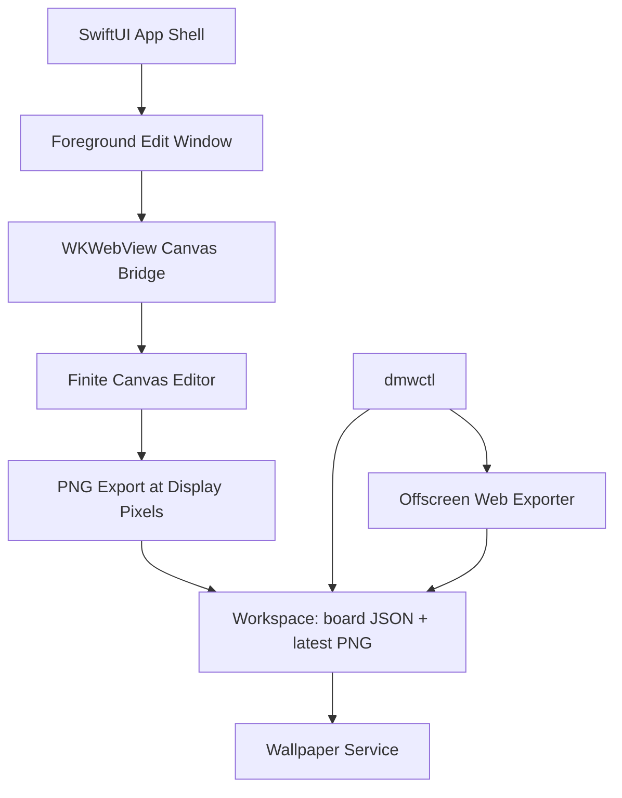
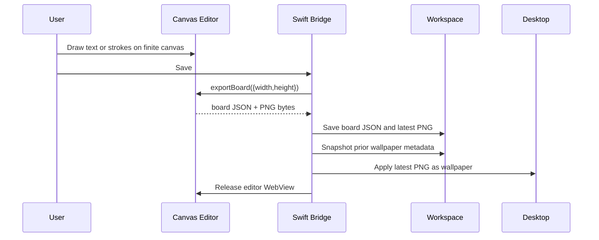
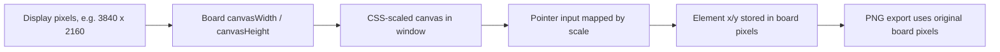

# feat: Replace Templates with Finite Canvas Editor

## Summary

Rework Desktop Memory Wall v2 around a blank, finite, Excalidraw-like canvas whose coordinate system matches the active desktop. Edit mode should open directly into a clean canvas with minimal tools, use LXGW WenKai for all text, and save by exporting the same canvas pixels that become the wallpaper.

---

## Problem Frame

The current version proves the local workspace, SwiftUI shell, wallpaper boundary, and CLI primitives, but it still feels like a text form that generates a wallpaper. The user wants the opposite: open edit mode, see a blank desktop-sized canvas, write or doodle directly where the wallpaper content should appear, save, and get the exact same composition on the desktop.

The existing template-first default also conflicts with the desired product identity. Desktop Memory Wall should feel like opening Excalidraw to a clean canvas, not like opening a daily-planner template.

---

## Requirements

### Canvas Experience

- R1. Edit mode opens to a blank canvas with no starter template, no prefilled text, and no right-side text editor.
- R2. The canvas is finite and sized to the active display's wallpaper pixel dimensions.
- R3. The editor displays the full desktop canvas scaled into the window while preserving the final wallpaper coordinate system.
- R4. Text, strokes, erasures, and moved elements save at the same positions where the user placed them.
- R5. The editor UI stays minimal: selection, text, pen, eraser/delete, undo/redo, save, and cancel.

### Typography and Visual Style

- R6. Text uses LXGW WenKai as the primary font for Chinese, English, and digits.
- R7. The font is bundled locally so editing and export work offline and match across machines.
- R8. The default background is a quiet Excalidraw-like warm off-white unless the user changes it later.

### Save, Render, and Wallpaper Behavior

- R9. Save exports the editor canvas to PNG and uses that PNG as the wallpaper source of truth.
- R10. Swift must not re-layout or re-render text on the save path because that breaks WYSIWYG.
- R11. The prior wallpaper snapshot and restore path remain intact.
- R12. Closing or saving edit mode releases the live editor surface so idle cost stays low.

### Agent First and Maintenance

- R13. Agent primitives continue to read, patch, preview, apply, restore, and diagnose the same workspace.
- R14. Template commands and starter-template assets are removed or demoted out of the active product path.
- R15. Tests cover blank first launch, finite-canvas coordinate mapping, font asset availability, export dimensions, save/apply behavior, and destructive confirmation gates.

---

## Key Technical Decisions

- KTD1. Finite desktop canvas, not infinite pan space: the board's logical canvas is the active display pixel rectangle. Zooming may help editing, but panning beyond the desktop is not part of v2.
- KTD2. Web canvas export is the wallpaper source: the editor's HTML canvas exports the PNG that becomes the wallpaper. This removes the current mismatch where Swift draws text differently from the editor.
- KTD3. Blank board becomes the default workspace contract: `BoardDocument.defaultMemoryWall` becomes an empty board factory and the template subsystem stops seeding task text.
- KTD4. LXGW WenKai is bundled as an app asset: CSS `@font-face` and export code use the same local font file so Chinese, English, and digits share one visual language.
- KTD5. Minimal custom editor over full Excalidraw embed: v2 should emulate the small interaction surface needed for the memory wall instead of pulling in all Excalidraw behaviors, libraries, and infinite-canvas assumptions.
- KTD6. Keep Agent First through primitive board operations: agent commands mutate canvas elements and request exports, but they do not decide the user's reminder content or introduce templates.

---

## High-Level Technical Design

### Component Topology



### Save Lifecycle



### Coordinate Model



---

## Output Structure

```text
App/DesktopMemoryWallApp/Resources/Editor/
App/DesktopMemoryWallApp/Resources/Fonts/
EditorWeb/src/canvas/
EditorWeb/src/bridge/
Sources/MemoryWallCore/
Sources/MemoryWallEditorBridge/
Sources/MemoryWallAgentTools/
Tests/MemoryWallCoreTests/
Tests/MemoryWallEditorBridgeTests/
Tests/MemoryWallAgentToolsTests/
docs/architecture/tool-parity.md
docs/operations/diagnostics.md
```

---

## Implementation Units

### U1. Blank Finite Board Model

- **Goal:** Replace the template-shaped default board with a blank finite canvas model that records display-sized board dimensions and canvas elements.
- **Requirements:** R1, R2, R3, R4, R14, R15.
- **Dependencies:** None.
- **Files:** `Sources/MemoryWallCore/BoardDocument.swift`, `Sources/MemoryWallCore/BoardElement.swift`, `Sources/MemoryWallCore/Preferences.swift`, `Tests/MemoryWallCoreTests/BoardDocumentTests.swift`, `Tests/MemoryWallCoreTests/PreferencesTests.swift`.
- **Approach:** Add canvas width, canvas height, background color, and viewport-independent element positions to the board contract. Convert `defaultMemoryWall` into a blank board factory and remove assumptions that first launch contains title/task text.
- **Patterns to follow:** Keep domain models Codable, Equatable, Sendable, and path-independent as they are now.
- **Test scenarios:**
  - Creating a default board for a 3840 x 2160 display produces no elements and records those canvas dimensions.
  - Loading old boards with existing elements remains possible through backward-compatible defaults.
  - Preferences default to LXGW WenKai and warm off-white background.
  - Empty boards serialize and deserialize without inserting template text.
- **Verification:** A fresh workspace can be created with a blank active board and no template content.

### U2. Canvas Editor Web App

- **Goal:** Replace the textarea-based editor asset with a finite canvas editor that supports selection, text, pen, eraser/delete, undo/redo, save, and cancel.
- **Requirements:** R1, R2, R3, R4, R5, R8, R12, R15.
- **Dependencies:** U1.
- **Files:** `EditorWeb/src/canvas/CanvasEditor.ts`, `EditorWeb/src/canvas/tools.ts`, `EditorWeb/src/canvas/geometry.ts`, `EditorWeb/src/bridge/nativeBridge.ts`, `EditorWeb/src/theme.ts`, `EditorWeb/src/__tests__/canvasGeometry.test.js`, `Sources/MemoryWallEditorBridge/Resources/Editor/index.html`, `App/DesktopMemoryWallApp/Resources/Editor/index.html`, `Tests/MemoryWallEditorBridgeTests/EditorBridgeTests.swift`.
- **Approach:** Use a local HTML canvas or SVG-backed scene with board-pixel coordinates and a CSS scale transform for display. Pointer input converts window coordinates back to board pixels before mutating elements.
- **Patterns to follow:** Keep the editor an adapter. Swift owns persistence and wallpaper lifecycle; the editor owns interactive drawing and export.
- **Test scenarios:**
  - A pointer at scaled editor coordinates maps to the expected board pixel coordinates.
  - Text created at x/y persists with the same x/y in the emitted board payload.
  - Pen strokes preserve point arrays and color/width across save/load.
  - Eraser/delete removes the targeted element without deleting unrelated elements.
  - Undo and redo restore prior board states for text and stroke edits.
- **Verification:** Opening edit mode shows a blank canvas with a compact toolbar and no right-side text panel.

### U3. Local LXGW WenKai Font Pipeline

- **Goal:** Bundle LXGW WenKai and make the editor, export path, and diagnostics verify that the font is available before editing or exporting.
- **Requirements:** R6, R7, R8, R15.
- **Dependencies:** U1, U2.
- **Files:** `App/DesktopMemoryWallApp/Resources/Fonts/`, `Sources/MemoryWallEditorBridge/Resources/Fonts/`, `EditorWeb/src/theme.ts`, `EditorWeb/src/canvas/fontLoader.ts`, `script/build_editor_assets.sh`, `script/package_app.sh`, `Tests/MemoryWallEditorBridgeTests/EditorBridgeTests.swift`, `docs/operations/diagnostics.md`.
- **Approach:** Add the font file to both app and editor bridge resources, declare CSS `@font-face`, wait for `document.fonts.ready` before first render/export, and surface a diagnostics failure if the font is missing.
- **Patterns to follow:** Mirror the existing resource-bundle lookup in `LocalEditorAssetLocator` and the existing editor asset copy script.
- **Test scenarios:**
  - Resource lookup finds the bundled LXGW WenKai asset.
  - The editor reports font readiness before export.
  - Missing font assets produce a clear diagnostics failure instead of silently falling back to system fonts.
  - Exported text uses the configured font family in the web rendering path.
- **Verification:** Chinese, English, and digits render with one visual style in edit mode and exported PNGs.

### U4. WYSIWYG Export Bridge

- **Goal:** Make save and preview use the web canvas export path so the final wallpaper exactly matches the editor composition.
- **Requirements:** R4, R9, R10, R11, R12, R13, R15.
- **Dependencies:** U1, U2, U3.
- **Files:** `Sources/MemoryWallEditorBridge/EditorBridge.swift`, `Sources/MemoryWallEditorBridge/WebEditorCoordinator.swift`, `Sources/MemoryWallEditorBridge/WebEditorView.swift`, `Sources/MemoryWallRenderer/BoardRenderer.swift`, `Sources/MemoryWallRenderer/RenderJob.swift`, `Tests/MemoryWallEditorBridgeTests/EditorBridgeTests.swift`, `Tests/MemoryWallRendererTests/BoardRendererTests.swift`.
- **Approach:** Extend the bridge protocol so save returns board JSON plus PNG bytes at the board's native canvas size. Keep `NativeBoardRenderer` only as a fallback or retire it from the primary save path to avoid duplicate layout logic.
- **Patterns to follow:** Preserve the protocol boundary around render/export services so tests can use fakes instead of live wallpaper calls.
- **Test scenarios:**
  - Exporting a 3840 x 2160 board returns PNG metadata with exactly that size.
  - The save path writes the PNG returned by the editor without re-rendering text in Swift.
  - Invalid export messages fail safely and do not overwrite the latest valid wallpaper image.
  - Closing the edit window releases the `WKWebView` owner reference.
- **Verification:** A text element placed near a canvas corner appears at the same relative location in the saved wallpaper PNG.

### U5. App Shell Simplification

- **Goal:** Make the native app open directly into the finite canvas editor and remove the current form-like editing UI.
- **Requirements:** R1, R3, R5, R9, R11, R12, R15.
- **Dependencies:** U1, U2, U4.
- **Files:** `App/DesktopMemoryWallApp/Scenes/EditWindowScene.swift`, `App/DesktopMemoryWallApp/Scenes/MenuBarScene.swift`, `App/DesktopMemoryWallApp/ViewModels/AppStateStore.swift`, `App/DesktopMemoryWallApp/DesktopMemoryWallApp.swift`, `Tests/MemoryWallWallpaperTests/WallpaperServiceTests.swift`, `Tests/MemoryWallEditorBridgeTests/EditorBridgeTests.swift`.
- **Approach:** Remove the right-side `TextEditor`, route save/cancel through the bridge, keep one foreground editor window, and keep restore available from the menu.
- **Patterns to follow:** Keep SwiftUI scene ownership explicit and keep wallpaper operations in `WallpaperService`.
- **Test scenarios:**
  - Opening edit mode creates exactly one editor surface.
  - Save persists board JSON, writes latest PNG, snapshots the prior wallpaper, applies the wallpaper, and closes the editor.
  - Cancel closes the editor without writing a new PNG or applying wallpaper.
  - Restore still uses the same service path as before.
- **Verification:** The app visually resembles a minimal Excalidraw session rather than a split form/editor window.

### U6. Agent Tools and Template Removal

- **Goal:** Keep Agent First parity while removing template-first behavior from CLI, workspace seeding, docs, and tests.
- **Requirements:** R13, R14, R15.
- **Dependencies:** U1, U4, U5.
- **Files:** `Sources/MemoryWallAgentTools/ToolRegistry.swift`, `Sources/MemoryWallAgentTools/ToolContext.swift`, `Sources/MemoryWallWorkspace/WorkspaceLayout.swift`, `Sources/MemoryWallWorkspace/TemplateStore.swift`, `Sources/MemoryWallCore/Template.swift`, `Tests/MemoryWallAgentToolsTests/ToolRegistryTests.swift`, `Tests/MemoryWallWorkspaceTests/WorkspaceStoreTests.swift`, `Tests/dmwctlTests/CommandParityTests.swift`, `docs/architecture/tool-parity.md`, `README.md`.
- **Approach:** Remove or hide `templates list/apply` from the active command contract. Add primitive board commands for creating a blank board, adding text at coordinates, adding strokes, reading board dimensions, exporting preview, applying wallpaper, and restoring wallpaper.
- **Patterns to follow:** Preserve machine-readable `ToolResult` output and `--confirm` gates for visible desktop changes.
- **Test scenarios:**
  - `dmwctl status --json` reports board dimensions and element count for a blank board.
  - Coordinate-based `board patch` writes an element at the requested x/y without applying wallpaper.
  - Template commands are absent, deprecated with a clear message, or kept only as compatibility aliases outside the primary docs.
  - `wallpaper apply` still rejects calls without `--confirm`.
- **Verification:** An external agent can create a blank board, place content by coordinates, export preview, apply wallpaper, and restore without using private app APIs.

### U7. Packaging, Diagnostics, and Visual Regression Checks

- **Goal:** Harden the v2 packaging path and add checks that catch WYSIWYG, font, and launch regressions.
- **Requirements:** R7, R9, R10, R12, R15.
- **Dependencies:** U2, U3, U4, U5, U6.
- **Files:** `script/build_editor_assets.sh`, `script/package_app.sh`, `script/open_app.sh`, `docs/operations/diagnostics.md`, `docs/operations/performance-budgets.md`, `docs/operations/post-deploy-validation.md`, `Tests/dmwctlTests/DiagnosticsCommandTests.swift`, `EditorWeb/src/__tests__/exportBoard.test.js`.
- **Approach:** Validate that the packaged app contains editor assets and font assets, that `open_app.sh` works as the reliable local launch path, and that diagnostics reports editor/font/export readiness.
- **Patterns to follow:** Build on the current script-based app packaging but treat LaunchServices quirks as an explicit operational risk until a full Xcode app bundle exists.
- **Test scenarios:**
  - Packaging includes editor HTML and LXGW WenKai font resources.
  - Diagnostics reports missing editor or font resources as failures.
  - Export tests compare expected element coordinates against image dimensions.
  - Launch script starts one app process and does not leave stale duplicates.
- **Verification:** A fresh build can open the editor, export a display-sized PNG, and diagnose missing assets before wallpaper apply.

---

## Phased Delivery

### Phase 1. Data Model and Blank Defaults

- **Objective:** Remove template-shaped defaults and establish the finite board coordinate contract.
- **Inputs:** Current board model, workspace seeding, and user requirement for a blank Excalidraw-like open state.
- **Actions:** Complete U1 and the template-removal parts of U6 that affect first launch.
- **Outputs:** Blank board workspace with display dimensions and no starter text.
- **Validation:** Core and workspace tests prove no template text is inserted on first launch.
- **Risks:** Backward compatibility with current boards may break if decoding is too strict.
- **Upgrade path:** Add migration helpers only if real old-board samples fail during implementation.

### Phase 2. Finite Canvas Editor and Font

- **Objective:** Replace the textarea editor with an actual desktop-sized canvas and unified typography.
- **Inputs:** Current editor asset, bridge message protocol, and LXGW WenKai font asset.
- **Actions:** Complete U2 and U3.
- **Outputs:** Blank canvas editor with minimal tools and locally loaded font.
- **Validation:** Web geometry tests and asset tests pass.
- **Risks:** Canvas text editing can get complex if treated like a full word processor.
- **Upgrade path:** Start with single-line or simple multiline text boxes, then improve text editing after WYSIWYG is stable.

### Phase 3. WYSIWYG Save-to-Wallpaper

- **Objective:** Make exported canvas pixels the only wallpaper render source.
- **Inputs:** Canvas editor, bridge, workspace store, wallpaper service.
- **Actions:** Complete U4 and U5.
- **Outputs:** Save writes board JSON and the editor-exported PNG, then applies it.
- **Validation:** Export dimension tests and save/apply integration tests pass.
- **Risks:** Offscreen export for CLI may behave differently from visible export if it loads resources differently.
- **Upgrade path:** Share the same editor bundle and font readiness checks across visible and offscreen export.

### Phase 4. Agent Parity and Operational Hardening

- **Objective:** Keep the app agent-native while removing template product assumptions.
- **Inputs:** New board commands, diagnostics, packaging scripts.
- **Actions:** Complete U6 and U7.
- **Outputs:** Updated `dmwctl`, docs, diagnostics, packaging, and validation checks.
- **Validation:** CLI parity tests and diagnostics tests pass.
- **Risks:** Existing template tests and docs may leave stale product language.
- **Upgrade path:** Add richer primitives for shapes/arrows after text and pen feel right.

---

## Acceptance Examples

- AE1. Given no workspace exists, when the app opens edit mode, then the user sees a blank off-white finite canvas with a minimal toolbar and no prefilled text.
- AE2. Given the active display is 3840 x 2160, when the user writes near the top-left of the editor canvas and saves, then the wallpaper PNG is 3840 x 2160 and the text appears at the same relative location.
- AE3. Given the user draws a pen stroke and deletes it, when they save, then the deleted stroke is absent from the persisted board and exported PNG.
- AE4. Given the LXGW WenKai font asset is missing, when diagnostics run, then the output reports a font readiness failure before export or wallpaper apply.
- AE5. Given an agent uses coordinate-based board commands, when it renders a preview, then the preview reflects the same positions as the board JSON without applying wallpaper.

---

## Scope Boundaries

### In Scope

- Blank finite desktop canvas.
- Minimal Excalidraw-like tools: selection, text, pen, eraser/delete, undo/redo, save, cancel.
- LXGW WenKai bundled font and consistent edit/export typography.
- WYSIWYG PNG export used for wallpaper apply.
- Removal of template-first first-launch behavior and docs.
- CLI parity for primitive board and wallpaper operations.

### Deferred to Follow-Up Work

- Full Excalidraw feature parity, including arrows, libraries, multiplayer, image embeds, and infinite canvas navigation.
- Rich typography controls beyond the default font, size, color, and simple text boxes.
- Multiple boards or board gallery UI.
- Multi-display simultaneous editing.
- Full notarized `.app` distribution.

### Outside This Product's Identity

- A general drawing app.
- A project-management planner with built-in templates.
- A live wallpaper engine.
- A cloud whiteboard or sync service.

---

## System-Wide Impact

- **Product identity:** The app shifts from planner-template wallpaper generation to a clean memory-wall canvas.
- **Rendering correctness:** The web export path becomes load-bearing because it owns final pixels.
- **Agent contract:** Template primitives leave the primary surface and coordinate-based primitives become central.
- **Packaging:** Font and editor resources become required runtime assets.
- **Performance:** Idle behavior remains lightweight only if the editor WebView is released after save/cancel.

---

## Risks and Mitigations

| Risk | Mitigation |
|---|---|
| Canvas text editing becomes too complex. | Start with movable text boxes and simple multiline support; defer word-processor behavior. |
| Export differs from edit view because fonts load late. | Gate export on font readiness and test missing-font diagnostics. |
| CLI export diverges from app export. | Use the same bundled editor/exporter for visible and offscreen export paths. |
| Removing templates breaks existing docs/tests. | Update tests and docs in the same unit that removes template commands. |
| Hand-built app packaging remains fragile. | Keep `open_app.sh` as the reliable local launch path and document full app-bundle hardening as follow-up. |

---

## Documentation and Operational Notes

- Update `README.md` to describe the blank canvas workflow instead of template commands.
- Update `docs/architecture/tool-parity.md` with coordinate-based board primitives.
- Update `docs/operations/diagnostics.md` with editor asset, font asset, export readiness, and launch-script checks.
- Update `docs/operations/performance-budgets.md` to define idle, editing, export, and wallpaper-apply expectations for the canvas editor.

---

## Sources and Research

- Current v1 plan and implementation: `docs/plans/2026-06-19-001-feat-desktop-memory-wall-plan.md`, `App/DesktopMemoryWallApp/Scenes/EditWindowScene.swift`, `Sources/MemoryWallCore/BoardDocument.swift`, `Sources/MemoryWallRenderer/BoardRenderer.swift`, `Sources/MemoryWallAgentTools/ToolRegistry.swift`.
- LXGW WenKai upstream project and OFL license reference: https://github.com/lxgw/LxgwWenKai and https://github.com/lxgw/LxgwWenkaiKR/blob/main/OFL.txt.
