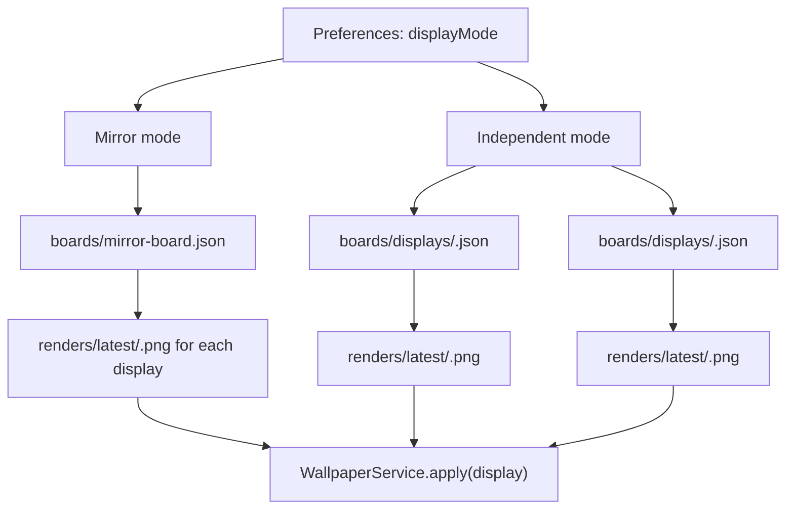
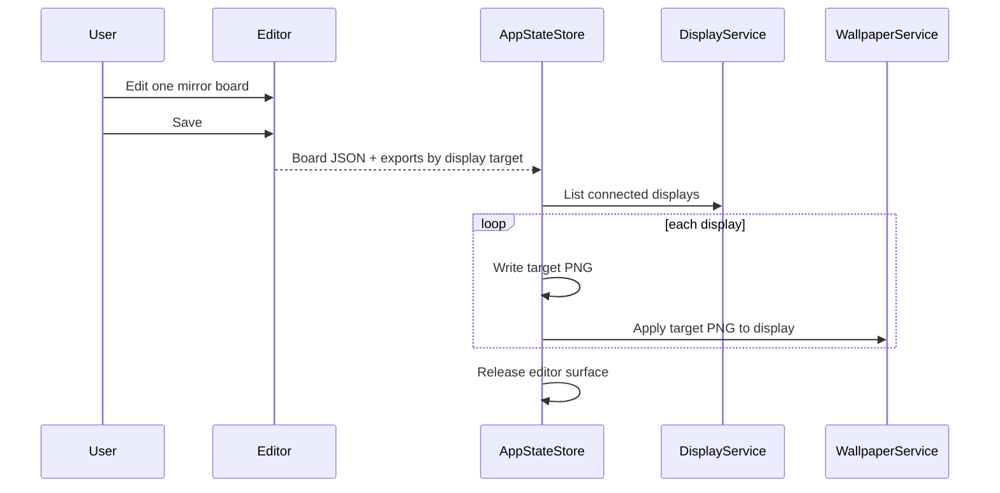
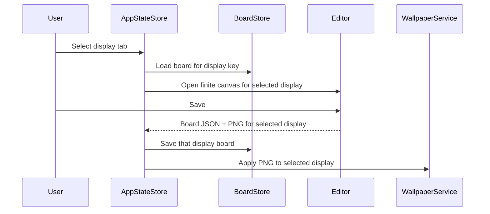

# feat: Add Mirror and Independent Multi-Display Modes

## Summary

Add two explicit multi-display modes to Desktop Memory Wall: a mirror-sync mode where one edited board is applied to every display, and an independent mode where each display owns its own board. Do not add a stitched large-canvas mode.

---

## Problem Frame

The current app assumes one active board, one active display, and one latest wallpaper PNG. That is enough for a single-screen workflow, but it cannot express the two product modes the user wants: one board synchronized across all screens, or separate content per screen. The implementation must preserve the v2 identity: blank finite canvases, WYSIWYG editor export, local resources, and low idle cost.

---

## Requirements

### Display Modes

- R1. The app supports exactly two active multi-display modes: mirror sync and independent per-display boards.
- R2. The app does not introduce stitched desktop canvases, cross-screen drag space, or content spanning multiple screens.
- R3. The selected display mode persists in local preferences and is visible in the app UI and CLI diagnostics.

### Mirror Sync

- R4. Mirror mode has one source board that the user edits once.
- R5. Saving in mirror mode applies the same board composition to every connected display.
- R6. Mirror export creates one wallpaper image per display at that display's pixel dimensions, using the web export path so text layout remains consistent.
- R7. If displays have different aspect ratios, mirror mode scales the same board composition into each target instead of changing the board content.

### Independent Displays

- R8. Independent mode has a separate board for each display identity.
- R9. The editor lets the user choose which display board to edit.
- R10. Saving an independent board applies only to that display by default, with a separate command path to apply all display boards.
- R11. New displays receive a blank board seeded with that display's pixel dimensions.

### Persistence, Restore, and Agent First

- R12. Workspace files distinguish mirror board state, per-display board state, and per-display render outputs.
- R13. Wallpaper snapshots and restore work per display and can restore all displays when requested.
- R14. `dmwctl` can inspect mode, switch mode, read/write a target board, render target previews, apply all displays, and restore all displays.
- R15. Existing single-screen behavior remains the default-compatible path when only one display is connected.

---

## Key Technical Decisions

- KTD1. No stitched canvas: the app never builds one large virtual desktop board, because the user only wants mirror sync and independent screens.
- KTD2. Mirror is one source board plus per-display exports: the board remains one logical canvas, and save/export produces target-sized PNGs for each connected display.
- KTD3. Independent mode stores one board per display key: per-display content stays separate and does not share element lists.
- KTD4. Web export remains the primary text-rendering source: multi-display export must call the same canvas rendering code for each target size instead of relying on Swift text re-layout.
- KTD5. Display identity needs a resilient key: use the AppKit display ID when available, with name and pixel size retained as fallback metadata for reconnect scenarios.
- KTD6. Agent parity is mode-aware: every UI action for mode selection, display targeting, apply, and restore has a primitive CLI equivalent.

---

## High-Level Technical Design

### Mode Topology



### Mirror Save Flow



### Independent Save Flow



---

## Workspace Contract

```text
boards/active-board.json                 # compatibility alias or mirror board pointer
boards/mirror-board.json                 # mirror source board
displays/display-map.json                # last seen display keys and metadata
boards/displays/<display-key>.json       # independent-mode board per display
renders/latest/<display-key>.png         # latest wallpaper output per display
renders/previews/<display-key>-*.png     # previews per display
snapshots/wallpapers/<display-key>/*.json
preferences.json                         # displayMode and selectedDisplayKey
```

---

## Implementation Units

### U1. Display Mode and Display Identity Model

- **Goal:** Add durable mode and display identity primitives that both UI and CLI can share.
- **Requirements:** R1, R2, R3, R15.
- **Files:** `Sources/MemoryWallCore/Preferences.swift`, `Sources/MemoryWallCore/DisplayProfile.swift`, `Sources/MemoryWallCore/DisplayMode.swift`, `Tests/MemoryWallCoreTests/PreferencesTests.swift`, `Tests/MemoryWallCoreTests/DisplayProfileTests.swift`.
- **Approach:** Add a `DisplayMode` enum with `mirror` and `independent`, plus a display-key helper that normalizes AppKit IDs while retaining name, size, scale, and main-display metadata.
- **Patterns to follow:** Keep core models Codable, Equatable, Sendable, and independent of AppKit.
- **Test scenarios:**
  - Preferences default to mirror mode when no multi-display preference exists.
  - Unknown legacy preferences decode without losing existing hotkey and visual defaults.
  - Display keys are stable for the same display metadata and safe for file paths.
- **Verification:** Diagnostics can report the active display mode and connected display keys without touching wallpaper state.

### U2. Workspace Layout for Mirror and Per-Display Boards

- **Goal:** Split workspace persistence so mirror and independent boards can coexist safely.
- **Requirements:** R4, R8, R11, R12, R15.
- **Files:** `Sources/MemoryWallWorkspace/WorkspaceLayout.swift`, `Sources/MemoryWallWorkspace/BoardStore.swift`, `Sources/MemoryWallWorkspace/DisplayBoardStore.swift`, `Tests/MemoryWallWorkspaceTests/WorkspaceStoreTests.swift`, `Tests/MemoryWallWorkspaceTests/DisplayBoardStoreTests.swift`.
- **Approach:** Keep `boards/active-board.json` for compatibility, add `mirror-board.json`, add display-board helpers, and ensure missing per-display boards seed blank canvases at that display's pixel dimensions.
- **Patterns to follow:** Preserve snapshot-first behavior for board replacement and keep stores path-injectable for tests.
- **Test scenarios:**
  - A fresh workspace has a blank mirror board and no template content.
  - Loading an unknown display in independent mode creates a blank board with that display's dimensions.
  - Reconnecting a known display reuses the same display board when the display key matches.
  - Compatibility reads still return a valid active board for existing CLI consumers.
- **Verification:** Switching modes does not delete mirror or independent board content.

### U3. Multi-Target Web Export Bridge

- **Goal:** Let the editor export the same board to one or many display-sized PNGs without Swift re-rendering text.
- **Requirements:** R5, R6, R7, R10, R15.
- **Files:** `Sources/MemoryWallEditorBridge/EditorBridge.swift`, `Sources/MemoryWallEditorBridge/WebEditorView.swift`, `Sources/MemoryWallEditorBridge/Resources/Editor/index.html`, `App/DesktopMemoryWallApp/Resources/Editor/index.html`, `EditorWeb/src/canvas/geometry.js`, `EditorWeb/src/bridge/nativeBridge.js`, `EditorWeb/src/__tests__/exportBoard.test.js`, `Tests/MemoryWallEditorBridgeTests/EditorBridgeTests.swift`.
- **Approach:** Extend the bridge payload so Swift can provide export targets and the editor can return an array of `{displayKey,width,height,pngDataURL}` results. In mirror mode the editor exports all targets; in independent mode it exports the selected display target.
- **Patterns to follow:** Keep editor bridge messages narrow and testable with fake JSON payloads.
- **Test scenarios:**
  - A mirror save for two displays returns two PNG payloads with matching display keys.
  - Each export payload reports dimensions equal to its target display.
  - Export waits for LXGW WenKai before rendering target PNGs.
  - Malformed target export payloads fail safely and do not overwrite existing renders.
- **Verification:** Multi-display export uses the web canvas path for text, not `NativeBoardRenderer` text layout.

### U4. App UI for Mode and Display Targeting

- **Goal:** Add minimal UI controls for mode selection and display targeting without making the editor feel heavy.
- **Requirements:** R3, R4, R5, R8, R9, R10, R11.
- **Files:** `App/DesktopMemoryWallApp/ViewModels/AppStateStore.swift`, `App/DesktopMemoryWallApp/Scenes/EditWindowScene.swift`, `App/DesktopMemoryWallApp/Scenes/MenuBarScene.swift`, `App/DesktopMemoryWallApp/Scenes/SettingsScene.swift`, `Tests/MemoryWallEditorBridgeTests/EditorBridgeTests.swift`, `Tests/MemoryWallWallpaperTests/WallpaperServiceTests.swift`.
- **Approach:** Add a compact mode control outside the canvas chrome and a display selector only in independent mode. Keep the canvas itself blank and uncluttered.
- **Patterns to follow:** Keep SwiftUI scene ownership explicit and keep wallpaper side effects behind `WallpaperService`.
- **Test scenarios:**
  - Mirror mode opens one board and save applies generated images to all connected displays.
  - Independent mode opens the selected display's board and save applies only to that display.
  - Changing selected display loads the correct board without losing unsaved editor content silently.
  - Single-display setups do not show unnecessary display complexity.
- **Verification:** The editor remains a clean canvas with small mode/display controls rather than a planner-style form.

### U5. Wallpaper Apply and Restore Across Displays

- **Goal:** Add per-display apply and restore operations for both modes.
- **Requirements:** R5, R10, R13, R15.
- **Files:** `Sources/MemoryWallWallpaper/WallpaperService.swift`, `Sources/MemoryWallWallpaper/WallpaperSnapshot.swift`, `Sources/MemoryWallRenderer/RenderOutput.swift`, `Tests/MemoryWallWallpaperTests/WallpaperServiceTests.swift`.
- **Approach:** Add `applyAll` and `restoreAll` helpers that loop through display-specific render outputs and snapshots while preserving the existing single-display apply path.
- **Patterns to follow:** Keep `--confirm` and explicit actor metadata for visible desktop changes.
- **Test scenarios:**
  - Mirror apply writes one snapshot per display before setting wallpapers.
  - Independent apply only updates the selected display unless apply-all is requested.
  - Restore-all restores each display from its latest display-scoped snapshot.
  - A failure on one display reports which display failed and does not hide partial success.
- **Verification:** Multi-display wallpaper actions are auditable per display.

### U6. Agent CLI Parity and Diagnostics

- **Goal:** Make `dmwctl` mode-aware and display-target-aware.
- **Requirements:** R3, R12, R13, R14, R15.
- **Files:** `Sources/MemoryWallAgentTools/ToolRegistry.swift`, `Sources/MemoryWallAgentTools/ToolContext.swift`, `Tests/MemoryWallAgentToolsTests/ToolRegistryTests.swift`, `Tests/dmwctlTests/CommandParityTests.swift`, `Tests/dmwctlTests/DiagnosticsCommandTests.swift`, `docs/architecture/tool-parity.md`, `docs/operations/diagnostics.md`.
- **Approach:** Add primitives for reading mode, setting mode, listing display keys, reading/patching a target board, rendering a target preview, applying all displays, and restoring all displays.
- **Patterns to follow:** Preserve machine-readable `ToolResult` output and confirmation gates for visible desktop changes.
- **Test scenarios:**
  - `dmwctl diagnostics --json` reports mode, display count, display keys, and render readiness.
  - `dmwctl mode set mirror --json` switches to mirror without deleting independent boards.
  - `dmwctl board read --display <key> --json` reads the selected independent board.
  - `dmwctl wallpaper apply --all --confirm --json` applies all target renders.
- **Verification:** An external agent can operate both display modes without private app APIs.

### U7. Migration, Documentation, and Validation

- **Goal:** Preserve existing single-board users while documenting the two-mode model.
- **Requirements:** R12, R13, R14, R15.
- **Files:** `README.md`, `docs/architecture/overview.md`, `docs/architecture/tool-parity.md`, `docs/operations/diagnostics.md`, `docs/operations/post-deploy-validation.md`, `Tests/MemoryWallWorkspaceTests/WorkspaceStoreTests.swift`, `Tests/dmwctlTests/CommandParityTests.swift`.
- **Approach:** Treat existing `active-board.json` as the initial mirror board on migration, document the absence of stitched-canvas mode, and add validation steps for two physical or mocked displays.
- **Patterns to follow:** Keep local-first and restore-first operational language.
- **Test scenarios:**
  - Existing workspaces migrate to mirror mode with their current board preserved.
  - Documentation names mirror sync and independent mode as the only supported multi-display modes.
  - Post-deploy validation includes checking each display's wallpaper and restore path.
- **Verification:** A user upgrading from the current single-screen build keeps their board and gets mirror mode by default.

---

## Acceptance Examples

- AE1. Given two connected displays, when mirror mode saves a board, then both displays receive wallpaper images generated from the same board composition.
- AE2. Given displays with different sizes, when mirror mode saves, then each output PNG matches its target display's pixel dimensions.
- AE3. Given independent mode, when the user edits display A and saves, then display B's board JSON and wallpaper do not change.
- AE4. Given a newly connected display in independent mode, when the user selects it, then the editor opens a blank board sized to that display.
- AE5. Given `dmwctl wallpaper restore --all --confirm`, when snapshots exist for multiple displays, then each display restores from its own latest snapshot.

---

## Scope Boundaries

### In Scope

- Mirror sync mode.
- Independent per-display board mode.
- Per-display render outputs, wallpaper apply, and restore.
- Mode-aware UI, CLI, diagnostics, tests, and documentation.
- Migration from current single-board workspaces to mirror mode.

### Deferred to Follow-Up Work

- Rich per-display layout presets.
- Display arrangement diagrams in the UI.
- Advanced conflict handling when a display key changes after hardware reconnect.

### Outside This Product's Identity

- Stitched large desktop canvas.
- Content spanning multiple screens.
- Live wallpaper or always-on overlay behavior.
- Cloud sync for display boards.

---

## System-Wide Impact

- **Data model:** Preferences and workspace paths become mode-aware.
- **Editor bridge:** Save/export becomes target-aware and returns one or more PNG payloads.
- **Wallpaper lifecycle:** Apply and restore become per-display operations with all-display orchestration.
- **Agent contract:** CLI commands need explicit mode and display targeting.
- **Performance:** Mirror mode may export multiple PNGs during save, but idle behavior remains unchanged because the editor is still released afterward.

---

## Risks and Mitigations

| Risk | Mitigation |
|---|---|
| AppKit display IDs change after reconnect. | Store display ID plus name, size, scale, and main-display metadata; document fallback behavior. |
| Mirror exports look inconsistent across aspect ratios. | Pin a simple scale-to-target policy and test different target dimensions. |
| Multi-target export reintroduces Swift text layout mismatch. | Keep the web export path as the only primary save/export renderer. |
| Apply-all partially succeeds. | Return per-display result data and keep snapshots scoped by display. |
| UI becomes too complex. | Show only a small mode control and show the display picker only in independent mode. |

---

## Documentation and Operational Notes

- Update `README.md` with mirror and independent mode commands.
- Update `docs/architecture/overview.md` with workspace paths for display boards and renders.
- Update `docs/architecture/tool-parity.md` with mode and display-target CLI primitives.
- Update `docs/operations/diagnostics.md` with display key, mode, target render, and restore-all checks.
- Update `docs/operations/post-deploy-validation.md` with a two-display validation checklist.

---

## Sources and Local Grounding

- Current display discovery: `Sources/MemoryWallWallpaper/DisplayService.swift`.
- Current wallpaper apply and restore boundary: `Sources/MemoryWallWallpaper/WallpaperService.swift`.
- Current board workspace and active-board compatibility path: `Sources/MemoryWallWorkspace/WorkspaceLayout.swift`, `Sources/MemoryWallWorkspace/BoardStore.swift`.
- Current editor bridge and finite canvas export path: `Sources/MemoryWallEditorBridge/EditorBridge.swift`, `Sources/MemoryWallEditorBridge/Resources/Editor/index.html`.
- Current Agent First command surface: `Sources/MemoryWallAgentTools/ToolRegistry.swift`, `docs/architecture/tool-parity.md`.
